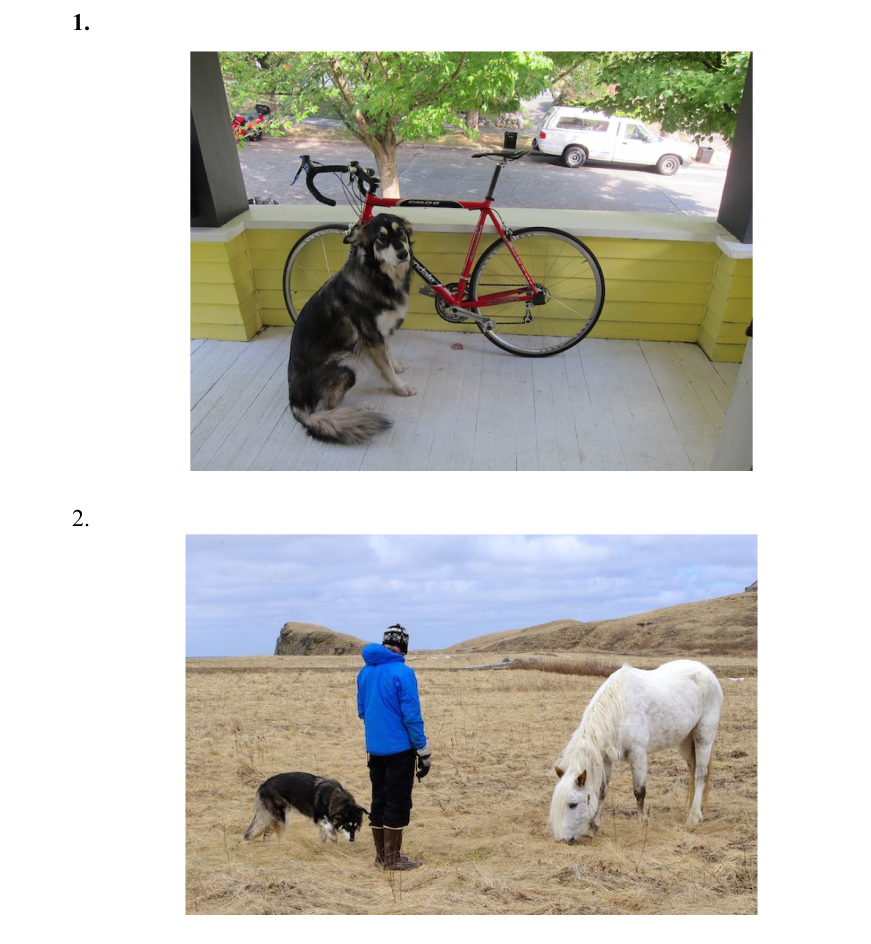
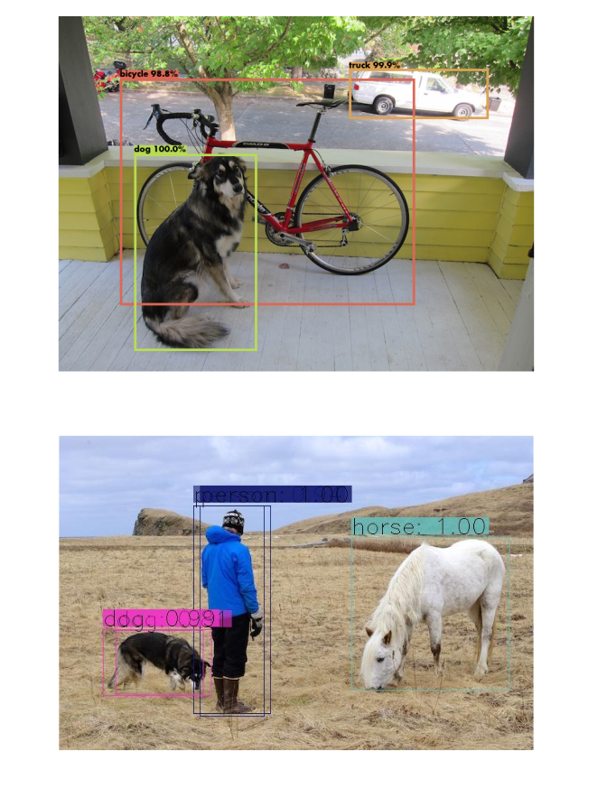

# Object Detection using YOLO

In this project, Object Detection is performed using YOLO algorithm. Some the challenges faced and YOLO's comparison with R-CNN is discussed in the project report.

## Tech Stack

- Python
- OpenCV
- Numpy

## Results

#### INPUT

#### OUTPUT

